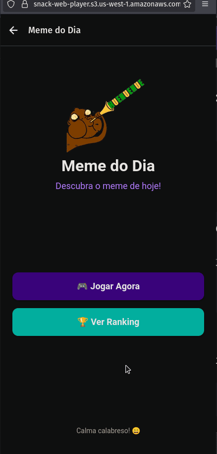

# 🎮 Meme do Dia - Jogo de Adivinhação

<div align="center">

[]()
[]()
[]()

Um jogo divertido e desafiador onde você precisa adivinhar o meme do dia!

</div>


## 📋 Visão Geral e Requisitos

### 🎯 Objetivo
Desenvolver um aplicativo mobile que apresenta um meme diferente a cada dia, onde o usuário deve adivinhar qual meme é baseado em uma imagem com zoom progressivo, dicas e sons característicos.

### 📱 Requisitos do Projeto
- ✅ Sistema progressivo de dificuldade (zoom + dicas)  
- ✅ Histórico local de jogos  
- ✅ Feedback tátil e sonoro  
- ✅ Interface moderna e intuitiva  


## 🛠 Tecnologias Utilizadas

### Plataforma & Framework
- **React Native** – Framework para desenvolvimento mobile  
- **Expo** – Plataforma para build e execução  
- **JavaScript/JSX** – Linguagem de programação

### Armazenamento & Backend
- **Firebase Realtime Database** – Banco de dados dos memes  
- **AsyncStorage** – Armazenamento local no dispositivo

### Bibliotecas Principais
- **Expo Haptics** – Feedback tátil  
- **Expo AV** – Reprodução de áudio  
- **React Navigation** – Navegação entre telas

### UI/UX
- **React Native Stylesheet** – Estilização  
- **TouchableOpacity** – Componentes interativos  
- **Custom Hooks** – Gerenciamento de estado  


## 🎮 Funcionalidades

### 🖼 Sistema de Jogo Principal
- **Meme Diário Único:** Um meme diferente por dia para todos os usuários  
- **Zoom Progressivo:** A imagem começa com 300% de zoom e reduz a cada erro  
- **Limite Diário:** Apenas uma tentativa por dia  

### 💡 Sistema de Ajuda Progressiva
| Tentativas | Recurso Liberado | Descrição |
|-------------|------------------|------------|
| 1–2 | Zoom Reduzido | Imagem vai ficando menos ampliada |
| 3 | Dica Textual | Descrição contextual do meme |
| 5 | Áudio | Som característico do meme |

### 📊 Histórico e Progresso
- Registro local de jogos  
- Exibição de estatísticas (tentativas por jogo)  
- Persistência de dados no dispositivo  

### 🔊 Feedback Multissensorial
- Vibração tátil em erros  
- Sons de feedback para acertos  
- Reprodução de áudio do meme após 5 tentativas  

### 🎨 Interface do Usuário
- Tema escuro moderno  
- Navegação intuitiva  
- Indicadores visuais de zoom  
- Botões com design consistente  


## 🎥 Demonstração

### 📸 GIF do Aplicativo



---

## 🎬 Fluxo do Usuário

1. **Home** → Botão “Jogar Agora”  
2. **Jogo** → Adivinha com zoom progressivo  
3. **Acerto** → Tela de parabéns e estatísticas  
4. **Histórico** → Exibe desempenho anterior  


## 🚀 Instalação e Execução

### 📲 Pré-requisitos
- App **Expo Go** instalado no celular (disponível na Play Store ou App Store)  
- Conta gratuita no **Expo** (opcional, mas recomendada para publicar o projeto)


### ⚡ Execução Rápida

1. **Baixe o projeto**
   - Faça o download do repositório como **.zip** pelo GitHub e extraia os arquivos,  
     **ou**
   - Clone o repositório diretamente:
     ```bash
     git clone [url-do-repositorio]
     ```

2. **Acesse o [Expo Snack](https://snack.expo.dev/)**
   - Abra o site do Expo Snack.  
   - Clique em **"Import GitHub"** ou **"Upload files"** e selecione a pasta do projeto.

3. **Execute o projeto**
   - Após o upload, clique em **"Run"** no canto superior direito.  
   - Escaneie o **QR Code** exibido usando o app **Expo Go** no celular.

4. **Pronto!**
   - O aplicativo abrirá automaticamente no seu dispositivo, sem precisar instalar nada localmente.


### 🔧 Execução Alternativa (opcional)
Se preferir rodar localmente, também é possível:
```bash
# Instale as dependências (se ainda não tiver feito)
npm install

# Inicie o servidor do Expo
npx expo start
```

### 💡 Aprendizados e Próximos Passos

#### 🎓 Reflexão sobre o Desenvolvimento

Durante o desenvolvimento deste projeto, foi possível compreender de forma prática como diferentes aspectos do ecossistema mobile se conectam para criar uma experiência completa.  
A implementação do sistema de jogo diário exigiu atenção especial à **persistência local de dados**, garantindo que as informações permanecessem disponíveis mesmo offline.  
A integração com o **Firebase Realtime Database** foi um dos pontos mais desafiadores, pois envolveu sincronização em tempo real e estruturação de dados de forma eficiente.

Além disso, trabalhar com **feedbacks táteis e sonoros** trouxe uma nova perspectiva sobre **UX em dispositivos móveis**, mostrando como pequenos detalhes podem melhorar significativamente a interação do usuário.  
Por fim, o uso de **React Native com Expo** demonstrou a praticidade da plataforma para criar e distribuir aplicativos de forma rápida, sem perder a qualidade da experiência final.

#### 🎯 Desafios Superados

- Sincronização de meme diário

- Balanceamento do sistema de zoom

- Otimização de performance

- Feedback claro ao usuário

#### 🚀 Próximos Passos

- Ranking global

- Modo desafio sem limite diário

- Login social (Google, Apple)

- Sistema de conquistas

- Perfil do usuário

- Migração para TypeScript

- Implementação de testes unitários

- Otimização de performance

<div align="center">
